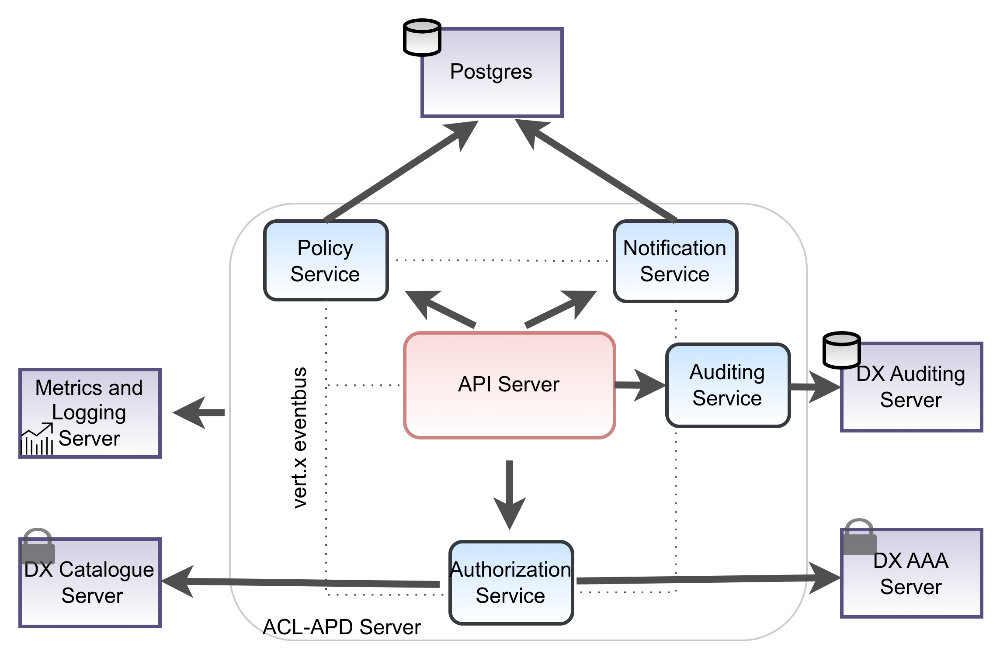

# API Server Interactions
The Data Exchange (DX) Access Control List (ACL) based Access Policy Domain (APD) is used for creating, requesting and managing policy. Provider, provider delegates could allow the consumer, consumer delegates to access their resources by writing a policy against it. Policies are verified by Data Exchange (DX) Authentication Authorization and Accounting Server (AAA) Server to allow consumer, consumer delegates to access the resource.

# API Server Solution Architecture
The following block diagram shows different components/services used in implementing the ACL-APD server.

The above setup allows specific high load containers/services to scale with ease. Various services of the resource server are detailed in the sections below.

## API Server
An API server is an HTTPS Web Server and serves as an API gateway for actors (consumers, providers, DX AAA Server) to interact with the different services provided by the DX ACL APD Server.
These services (as described below) may be database read/write services.  
It is also responsible for calling the Authorization Server (via the authorization service) to authenticate and authorize access to resources.

## Database Module
Postgres is called by the specific services like Policy service, Notification service, Auth service for policy, access-request related CRUD operations, to store email, first name and last name of the user requesting the APIs. While fetching access requests, policies from the database response are processed and displayed according to the newly created or updated records.

## Auditing Service
The Data Broker is used by the API Server to log information related to successful creation, deletion of policies and successful creation, updation, and deletion of access requests.

## Authentication Service
The authentication service interacts with the DX AAA Server to validate tokens provided by a consumer of a protected resource and to fetch information about the user.

## Policy Service
The policy service is used to create, delete or list policies, for the resources owned by the provider. Delegates of the provider could manage policies on behalf of the provider. They could provide user specific constraints while creating a policy for a certain consumer for a given resource. DX Auth Server checks if any policy is present for the given resource by using the verify policy API. The policy related information is stored in the database.

## Notification Service
Consumer or consumer delegates could request the provider to access the resource by using create access request API. An email is sent to the provider to approve the request for the resource on behalf of the consumer. Additional information like the purpose of accessing the resource (like academia, research, non-commercial) could be listed down to access the resource to help the provider take an informed decision while approving the request. Notification related information is stored in the database.
